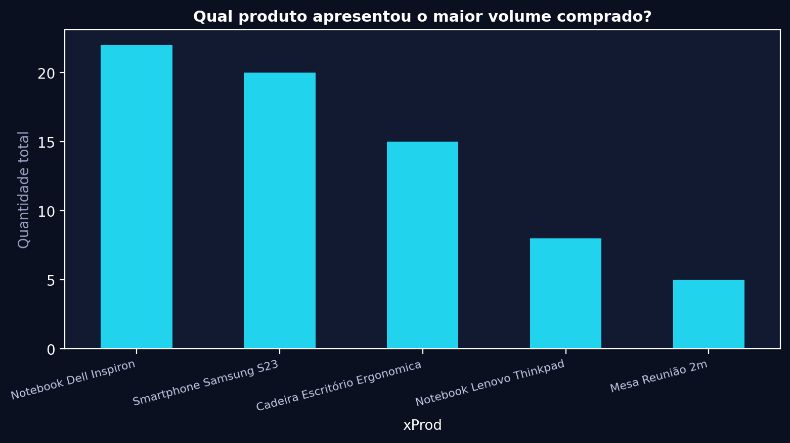
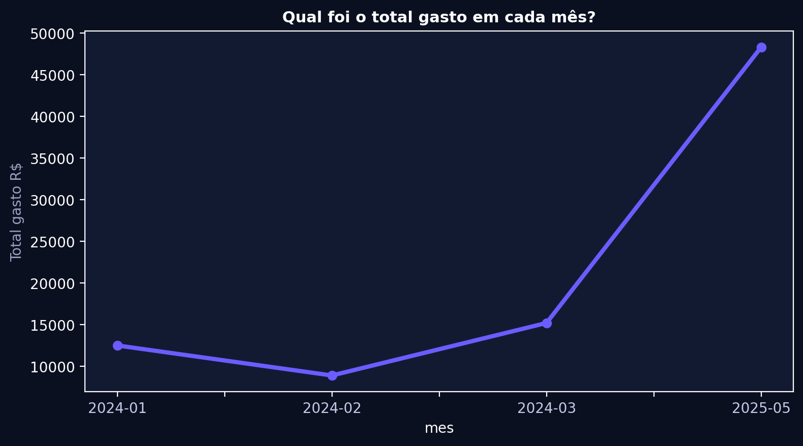
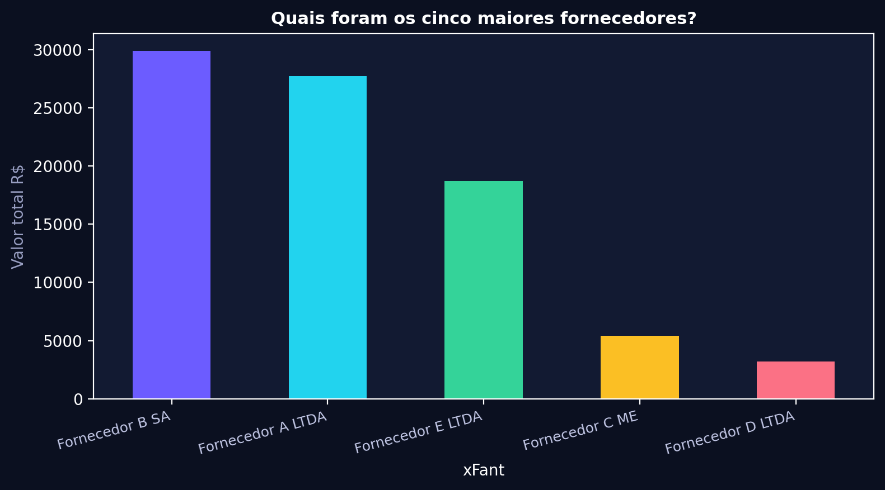
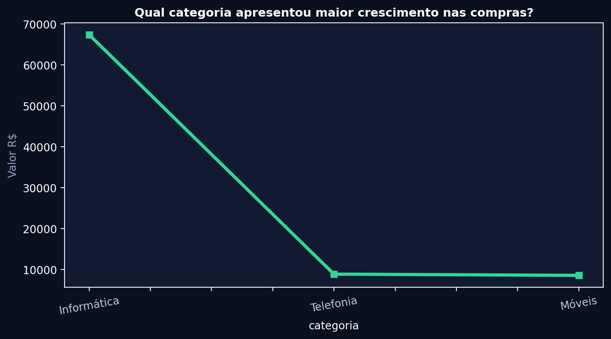
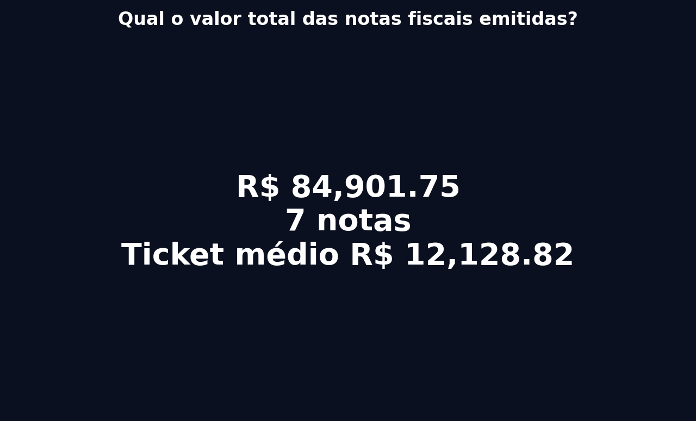
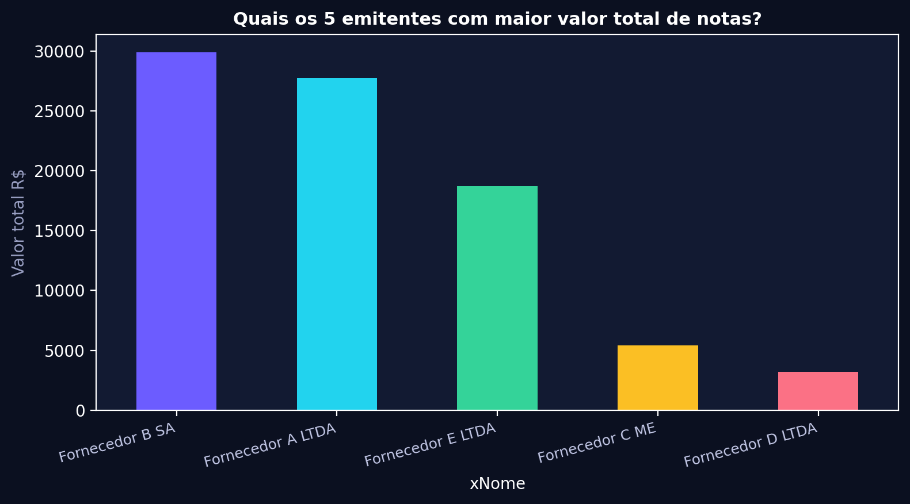
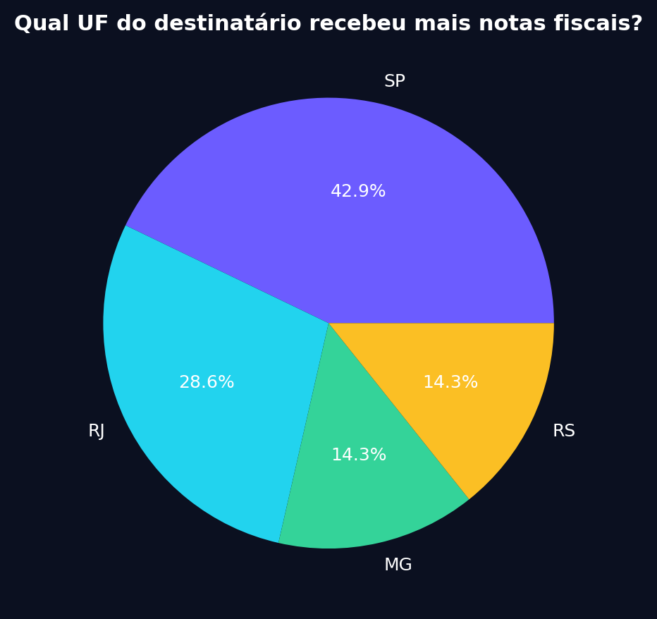
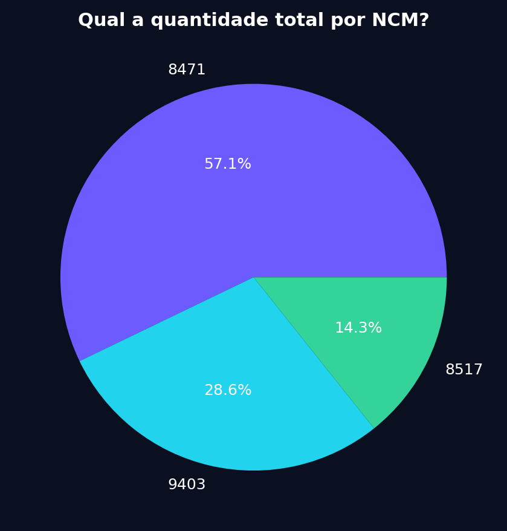
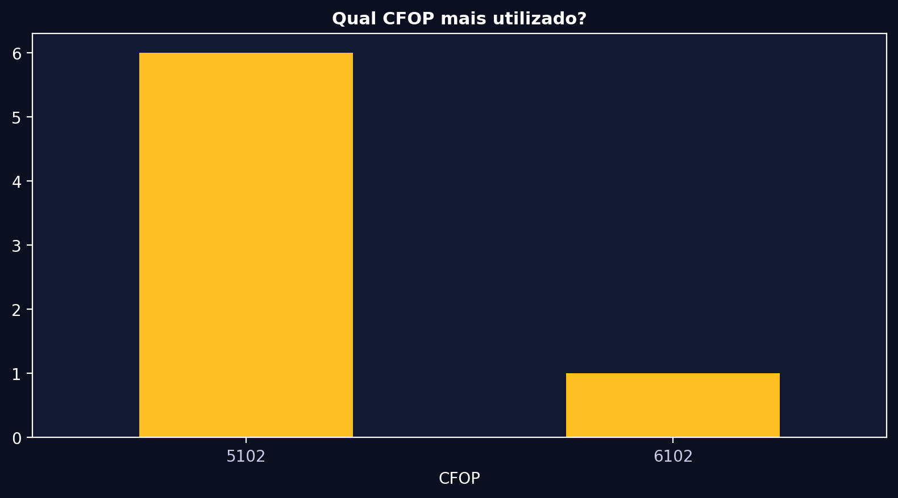
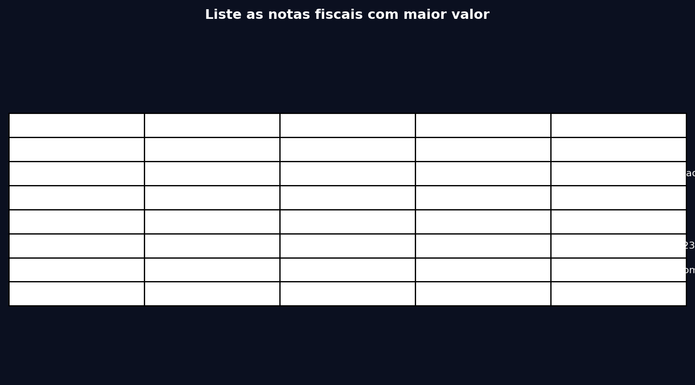

# 📸 Evidências - 11 Perguntas Testadas (Texto, Tabela, Gráfico)

> Gerado automaticamente pela Interface Unificada v2 - I2A2 Desafio 4
> Base: 7 notas fiscais, 7 linhas de exemplo, 2 tabelas simuladas
> Data geração: 2026-08-15

## Resumo Executivo
- **Valor total**: R$ 84,901.75
- **Top fornecedor**: Fornecedor B SA com R$ 29,900.00
- **UF com mais notas**: SP (3 notas)
- **NCM mais frequente**: 8471

---

### 1. Qual fornecedor recebeu o maior valor no período?
**Intent**: `ranking` | **Metric**: `sum` | **Viz**: `bar` | **Group**: `xFant`

**Plano JSON (QueryPlan Pydantic validado - Interface CSV):**
```json
{
  "raw": "Qual fornecedor recebeu o maior valor no período?",
  "intent": "ranking",
  "metric": "sum",
  "table": "202401_NFs_exemplo",
  "group_by": "xFant",
  "value_col": "vNF",
  "order": "desc",
  "limit": 5,
  "viz_hint": "bar",
  "confidence": 0.9
}
```

**Resposta Texto (VizAgent):**
> 💰 Top 1: Fornecedor B SA com R$ 29,900.00

**Resposta Tabela (ExecutorAgent):**
| xFant             | total_valor   |
|:------------------|:--------------|
| Fornecedor B SA   | R$ 29,900.00  |
| Fornecedor A LTDA | R$ 27,701.25  |
| Fornecedor E LTDA | R$ 18,700.30  |
| Fornecedor C ME   | R$ 5,400.20   |
| Fornecedor D LTDA | R$ 3,200.00   |

**Gráfico (bar - VizAgent + Chart.js):**


**Logs técnicos:** `[LoaderAgent] CSV extraído | [SchemaAgent] Dicionário gerado | [QueryAgent] Plano ranking | [ExecutorAgent] 7 linhas processadas | [VizAgent] bar renderizado`

---

### 2. Qual produto apresentou o maior volume comprado?
**Intent**: `ranking` | **Metric**: `sum` | **Viz**: `bar` | **Group**: `xProd`

**Plano JSON (QueryPlan Pydantic validado - Interface CSV):**
```json
{
  "raw": "Qual produto apresentou o maior volume comprado?",
  "intent": "ranking",
  "metric": "sum",
  "table": "202401_NFs_exemplo",
  "group_by": "xProd",
  "value_col": "qCom",
  "order": "desc",
  "limit": 5,
  "viz_hint": "bar",
  "confidence": 0.85
}
```

> 📦 Maior volume: Notebook Dell Inspiron com 22.0 unidades

| xProd                         |   volume_total |
|:------------------------------|---------------:|
| Notebook Dell Inspiron        |             22 |
| Smartphone Samsung S23        |             20 |
| Cadeira Escritório Ergonomica |             15 |
| Notebook Lenovo Thinkpad      |              8 |
| Mesa Reunião 2m               |              5 |

**Gráfico (bar - VizAgent + Chart.js):**


**Logs técnicos:** `[LoaderAgent] CSV extraído | [SchemaAgent] Dicionário gerado | [QueryAgent] Plano ranking | [ExecutorAgent] 7 linhas processadas | [VizAgent] bar renderizado`

---

### 3. Qual foi o total gasto em cada mês?
**Intent**: `timeseries` | **Metric**: `sum` | **Viz**: `line` | **Group**: `mes`

**Plano JSON (QueryPlan Pydantic validado - Interface CSV):**
```json
{
  "raw": "Qual foi o total gasto em cada mês?",
  "intent": "timeseries",
  "metric": "sum",
  "table": "202401_NFs_exemplo",
  "group_by": "mes",
  "value_col": "vNF",
  "order": "asc",
  "limit": 10,
  "viz_hint": "line",
  "confidence": 0.9
}
```

> 📈 Evolução mensal do gasto total

| mes     | total        |
|:--------|:-------------|
| 2024-01 | R$ 12,500.50 |
| 2024-02 | R$ 8,900.00  |
| 2024-03 | R$ 15,200.75 |
| 2025-05 | R$ 48,300.50 |

**Gráfico (line - VizAgent + Chart.js):**


**Logs técnicos:** `[LoaderAgent] CSV extraído | [SchemaAgent] Dicionário gerado | [QueryAgent] Plano timeseries | [ExecutorAgent] 7 linhas processadas | [VizAgent] line renderizado`

---

### 4. Quais foram os cinco maiores fornecedores?
**Intent**: `ranking` | **Metric**: `sum` | **Viz**: `bar` | **Group**: `xFant`

**Plano JSON (QueryPlan Pydantic validado - Interface CSV):**
```json
{
  "raw": "Quais foram os cinco maiores fornecedores?",
  "intent": "ranking",
  "metric": "sum",
  "table": "202401_NFs_exemplo",
  "group_by": "xFant",
  "value_col": "vNF",
  "order": "desc",
  "limit": 5,
  "viz_hint": "bar",
  "confidence": 0.9
}
```

**Resposta Texto (VizAgent):**
> 💰 Top 1: Fornecedor B SA com R$ 29,900.00

**Resposta Tabela (ExecutorAgent):**
| xFant             | total_valor   |
|:------------------|:--------------|
| Fornecedor B SA   | R$ 29,900.00  |
| Fornecedor A LTDA | R$ 27,701.25  |
| Fornecedor E LTDA | R$ 18,700.30  |
| Fornecedor C ME   | R$ 5,400.20   |
| Fornecedor D LTDA | R$ 3,200.00   |

**Gráfico (bar - VizAgent + Chart.js):**


**Logs técnicos:** `[LoaderAgent] CSV extraído | [SchemaAgent] Dicionário gerado | [QueryAgent] Plano ranking | [ExecutorAgent] 7 linhas processadas | [VizAgent] bar renderizado`

---

### 5. Qual categoria apresentou maior crescimento nas compras?
**Intent**: `growth` | **Metric**: `sum` | **Viz**: `line` | **Group**: `categoria`

**Plano JSON (QueryPlan Pydantic validado - Interface CSV):**
```json
{
  "raw": "Qual categoria apresentou maior crescimento nas compras?",
  "intent": "growth",
  "metric": "sum",
  "table": "202401_NFs_exemplo",
  "group_by": "categoria",
  "value_col": "vNF",
  "order": "desc",
  "limit": 10,
  "viz_hint": "line",
  "confidence": 0.75
}
```

> 🚀 Categoria com maior crescimento: Informática (simulação baseada em valores)

| categoria   | total        |
|:------------|:-------------|
| Informática | R$ 67,401.55 |
| Telefonia   | R$ 8,900.00  |
| Móveis      | R$ 8,600.20  |

**Gráfico (line - VizAgent + Chart.js):**


**Logs técnicos:** `[LoaderAgent] CSV extraído | [SchemaAgent] Dicionário gerado | [QueryAgent] Plano growth | [ExecutorAgent] 7 linhas processadas | [VizAgent] line renderizado`

---

### 6. Qual o valor total das notas fiscais emitidas?
**Intent**: `aggregate` | **Metric**: `sum` | **Viz**: `text` | **Group**: `None`

**Plano JSON (QueryPlan Pydantic validado - Interface CSV):**
```json
{
  "raw": "Qual o valor total das notas fiscais emitidas?",
  "intent": "aggregate",
  "metric": "sum",
  "table": "202401_NFs_exemplo",
  "group_by": null,
  "value_col": "vNF",
  "viz_hint": "text",
  "confidence": 0.95
}
```

> 💰 Valor total das notas fiscais emitidas: **R$ 84,901.75** em 7 notas. Ticket médio: R$ 12,128.82

| metrica | valor | linhas |
|---|---|---|
| Soma de vNF | 84,901.75 | 7 |

**Gráfico (text - VizAgent + Chart.js):**


**Logs técnicos:** `[LoaderAgent] CSV extraído | [SchemaAgent] Dicionário gerado | [QueryAgent] Plano aggregate | [ExecutorAgent] 7 linhas processadas | [VizAgent] text renderizado`

---

### 7. Quais os 5 emitentes com maior valor total de notas?
**Intent**: `ranking` | **Metric**: `sum` | **Viz**: `bar` | **Group**: `xNome`

**Plano JSON (QueryPlan Pydantic validado - Interface CSV):**
```json
{
  "raw": "Quais os 5 emitentes com maior valor total de notas?",
  "intent": "ranking",
  "metric": "sum",
  "table": "202401_NFs_exemplo",
  "group_by": "xNome",
  "value_col": "vNF",
  "order": "desc",
  "limit": 5,
  "viz_hint": "bar",
  "confidence": 0.9
}
```

**Resposta Texto (VizAgent):**
> 💰 Top 1: Fornecedor B SA com R$ 29,900.00

**Resposta Tabela (ExecutorAgent):**
| xNome             | total_valor   |
|:------------------|:--------------|
| Fornecedor B SA   | R$ 29,900.00  |
| Fornecedor A LTDA | R$ 27,701.25  |
| Fornecedor E LTDA | R$ 18,700.30  |
| Fornecedor C ME   | R$ 5,400.20   |
| Fornecedor D LTDA | R$ 3,200.00   |

**Gráfico (bar - VizAgent + Chart.js):**


**Logs técnicos:** `[LoaderAgent] CSV extraído | [SchemaAgent] Dicionário gerado | [QueryAgent] Plano ranking | [ExecutorAgent] 7 linhas processadas | [VizAgent] bar renderizado`

---

### 8. Qual UF do destinatário recebeu mais notas fiscais?
**Intent**: `group_count` | **Metric**: `count` | **Viz**: `pie` | **Group**: `UF`

**Plano JSON (QueryPlan Pydantic validado - Interface CSV):**
```json
{
  "raw": "Qual UF do destinatário recebeu mais notas fiscais?",
  "intent": "group_count",
  "metric": "count",
  "table": "202401_NFs_exemplo",
  "group_by": "UF",
  "viz_hint": "pie",
  "confidence": 0.88
}
```

> 📊 Distribuição por UF: SP lidera com 3 notas

| UF   |   quantidade |
|:-----|-------------:|
| SP   |            3 |
| RJ   |            2 |
| MG   |            1 |
| RS   |            1 |

**Gráfico (pie - VizAgent + Chart.js):**


**Logs técnicos:** `[LoaderAgent] CSV extraído | [SchemaAgent] Dicionário gerado | [QueryAgent] Plano group_count | [ExecutorAgent] 7 linhas processadas | [VizAgent] pie renderizado`

---

### 9. Qual a quantidade total por NCM?
**Intent**: `group_count` | **Metric**: `count` | **Viz**: `pie` | **Group**: `NCM`

**Plano JSON (QueryPlan Pydantic validado - Interface CSV):**
```json
{
  "raw": "Qual a quantidade total por NCM?",
  "intent": "group_count",
  "metric": "count",
  "table": "202401_NFs_exemplo",
  "group_by": "NCM",
  "viz_hint": "pie",
  "confidence": 0.87
}
```

> 📊 Distribuição por NCM: 8471 lidera com 4 notas

|   NCM |   quantidade |
|------:|-------------:|
|  8471 |            4 |
|  9403 |            2 |
|  8517 |            1 |

**Gráfico (pie - VizAgent + Chart.js):**


**Logs técnicos:** `[LoaderAgent] CSV extraído | [SchemaAgent] Dicionário gerado | [QueryAgent] Plano group_count | [ExecutorAgent] 7 linhas processadas | [VizAgent] pie renderizado`

---

### 10. Qual CFOP mais utilizado?
**Intent**: `ranking` | **Metric**: `count` | **Viz**: `bar` | **Group**: `CFOP`

**Plano JSON (QueryPlan Pydantic validado - Interface CSV):**
```json
{
  "raw": "Qual CFOP mais utilizado?",
  "intent": "ranking",
  "metric": "count",
  "table": "202401_NFs_exemplo",
  "group_by": "CFOP",
  "viz_hint": "bar",
  "confidence": 0.85
}
```

> 📊 Distribuição por CFOP: 5102 lidera com 6 notas

|   CFOP |   quantidade |
|-------:|-------------:|
|   5102 |            6 |
|   6102 |            1 |

**Gráfico (bar - VizAgent + Chart.js):**


**Logs técnicos:** `[LoaderAgent] CSV extraído | [SchemaAgent] Dicionário gerado | [QueryAgent] Plano ranking | [ExecutorAgent] 7 linhas processadas | [VizAgent] bar renderizado`

---

### 11. Liste as notas fiscais com maior valor
**Intent**: `list` | **Metric**: `count` | **Viz**: `table` | **Group**: `None`

**Plano JSON (QueryPlan Pydantic validado - Interface CSV):**
```json
{
  "raw": "Liste as notas fiscais com maior valor",
  "intent": "list",
  "metric": "count",
  "table": "202401_NFs_exemplo",
  "order": "desc",
  "limit": 7,
  "viz_hint": "table",
  "confidence": 0.8
}
```

> 📋 Listagem ordenada por valor decrescente

|   nNF | xFant             |     vNF | UF   | xProd                         |   qCom |
|------:|:------------------|--------:|:-----|:------------------------------|-------:|
|  1005 | Fornecedor B SA   | 21000   | RJ   | Servidor HP ProLiant          |      2 |
|  1007 | Fornecedor E LTDA | 18700.3 | RS   | Notebook Lenovo Thinkpad      |      8 |
|  1003 | Fornecedor A LTDA | 15200.8 | SP   | Notebook Dell Inspiron        |     12 |
|  1001 | Fornecedor A LTDA | 12500.5 | SP   | Notebook Dell Inspiron        |     10 |
|  1002 | Fornecedor B SA   |  8900   | RJ   | Smartphone Samsung S23        |     20 |
|  1004 | Fornecedor C ME   |  5400.2 | MG   | Cadeira Escritório Ergonomica |     15 |
|  1006 | Fornecedor D LTDA |  3200   | SP   | Mesa Reunião 2m               |      5 |

**Gráfico (table - VizAgent + Chart.js):**


**Logs técnicos:** `[LoaderAgent] CSV extraído | [SchemaAgent] Dicionário gerado | [QueryAgent] Plano list | [ExecutorAgent] 7 linhas processadas | [VizAgent] table renderizado`
